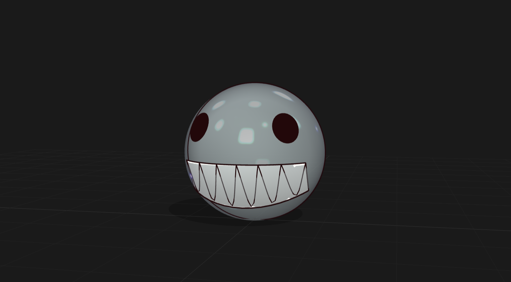

# Threeforge



Workspace for creating and exporting parametric 3D objects with [Three.js](https://threejs.org/). Each object is a standalone HTML file — no build step, no local dependencies. Open `index.html` in your browser and access any object in one click.

---

## How it works

1. `index.html` at the root is the gallery — it lists all registered objects
2. Each object lives in `src/objetos/<name>.html`, fully self-contained (HTML + CSS + JS inline)
3. Opening an object gives you an interactive 3D viewer with parameter sliders and export buttons

Each viewer:
- Renders geometry with Three.js (WebGL)
- Exposes sliders bound to the `PARAMS` object — changing a slider calls `buildGeometry()` and rebuilds the mesh in real time
- Lets you export in GLB, OBJ, STL, and PNG formats with no server required

---

## Getting started

### Open directly (simplest)

1. Clone or download this repository
2. Double-click `index.html` — it will open in your default browser
3. Click any object card to open its viewer
4. Use the sliders to adjust parameters and hit an export button to download the file

> Some browsers restrict local file access (`file://`). If the viewer loads blank, use Option 2.


## Creating a new object

Use the `/create-object <name>` skill in Claude Code. It runs the full flow:

1. Copies `src/_template/viewer-template.html` to `src/objetos/<name>.html`
2. Customizes the geometry, `PARAMS`, and sliders
3. Registers the card in the `OBJECTS` array inside `index.html`

> Run `/brainstorming` first — it's required to align the object design before implementation.

---

## Flow overview

```
index.html (gallery)
  └── src/objetos/<name>.html (standalone viewer)
        ├── PARAMS          → slider values
        ├── buildGeometry() → rebuilds mesh on every change
        └── export buttons  → GLB / OBJ / STL / PNG
```

---

## Export formats

| Format | Use case |
|--------|----------|
| `.glb` | Game engines, Blender, AR/VR |
| `.obj` | CAD, 3D printing, broad compatibility |
| `.stl` | 3D printing (slicers like Cura, PrusaSlicer) |
| `.png` | Preview, portfolio, documentation |

---

## File structure

```
.
├── index.html                        ← gallery
├── src/
│   ├── _template/
│   │   └── viewer-template.html      ← base for new objects (copy, don't edit)
│   └── objetos/
│       ├── cubo.html
│       └── bolha-de-sabao.html
├── assets/                           ← static images and resources
├── flow/                             ← flow documentation
└── exports/                          ← convention for exported files
```

---

## Stack

- **Three.js r160** via CDN (importmap) — no bundler
- **OrbitControls** — 3D navigation
- **GLTFExporter / OBJExporter / STLExporter** — export pipeline
- CSS and JS inline in each HTML — zero external files
- Font: `DM Mono`, Apple-inspired dark minimal palette
